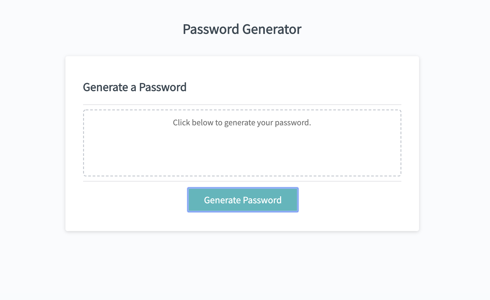

# 3-Password-Generator

This application was created to generate a random password based on user-selected criteria. This application runs in the browser and features dynamically updated HTML and CSS powered by JavaScript.

## Table of Contents
- [Overview](#Overview)
- [Notes](#Notes)
- [Credits](#Credits)

### Overview
This application was created to generate a random password based on user-selected criteria. This application runs in the browser and features dynamically updated HTML and CSS powered by JavaScript.

### Notes

Instructions:
1. The user clicks the button to begin generating a password.
2. The application presents a series of prompts to gain user criteria for password.
3. The password is generated and displayed in an alert.

CSS
- The CSS is linked using an external style sheet.

JavaScript
- The JavaScript is linked using an external script.

### Credits
Created by @aflavors. Feel free to contact me! :v: